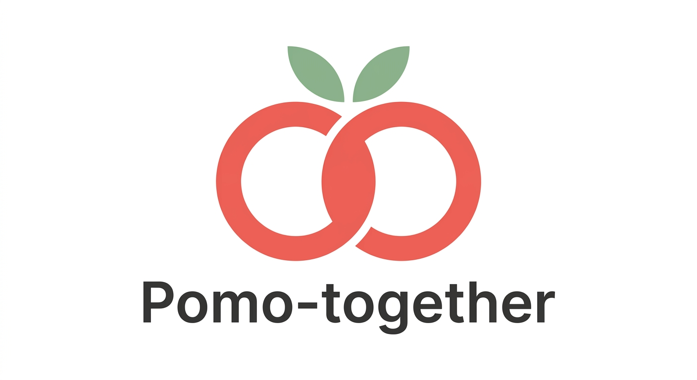

   

# Pomo-together

El sistema Pomo-together es una plataforma comunitaria de coworking virtual y salas de estudio sincrónicas diseñada para fomentar la productividad colectiva mediante la técnica Pomodoro en tiempo real.
